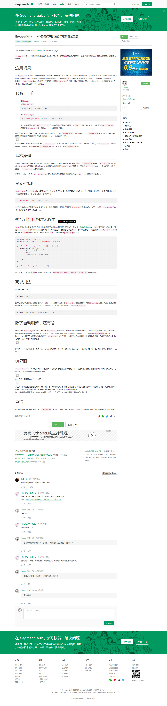

# browser-sync

browser-sync start --server --files "**"

hadoop@report:~/www/WebpackStudyDemo$ browser-sync start --server --files "**"
[Browsersync] Access URLs:
 ---------------------------------------
       Local: http://localhost:3000
    External: http://192.168.10.158:3000
 ---------------------------------------
          UI: http://localhost:3001
 UI External: http://192.168.10.158:3001
 ---------------------------------------
[Browsersync] Serving files from: ./
[Browsersync] Watching files...
[Browsersync] Couldn't open browser (if you are using BrowserSync in a headless environment, you might want to set the open option to false)
[Browsersync] Reloading Browsers...
[Browsersync] Reloading Browsers...
[Browsersync] Reloading Browsers...
